<!-- ══════════════════════════════  HEADER  ══════════════════════════════ -->
<h1 align="center">Daniel&nbsp;Shaulov</h1>

<p align="center">
  <b>Data &amp; Junior Analyst</b>&nbsp;·&nbsp;Economics &amp; Management
</p>

<p align="center">
  <i>I don't build charts to look at — I build models, dashboards, and research<br>someone actually reads on a Monday morning.</i>
</p>

<p align="center">
  <a href="https://danielshaulov.vercel.app"></a>
  <a href="https://linkedin.com/in/danielshaulov"></a>
  <a href="mailto:danielshaulov4@gmail.com"></a>
</p>

<p align="center">
  
  
  
</p>

---

### 🧭 About

I'm studying **Economics & Management** at the **Open University of Israel**, and I work with **Python, SQL, Power BI and advanced Excel** to answer questions that actually change a decision.

What sets me apart isn't just the tooling — it's the path here. I went from an **IDF combat soldier** to coordinating a national military-prep program to **freelancing as an analyst and developer**. That mix taught me discipline, ownership, and how to make a clear call under pressure. I bring the same to data: less decoration, more *"here's what's going on and here's what to do about it."*

> 🔭 Currently sharpening **financial modelling**, **macro/market analysis**, and **BI reporting** — and shipping projects built on real, messy datasets.

---

### 💡 What I bring to the table

<table>
  <tr>
    <td width="33%" valign="top">
      <h4>📈 Financial Analysis</h4>
      Market &amp; macro analysis, risk metrics (volatility, drawdown), correlation &amp; regression, and reading <b>financial statements</b> — interpreting assets through data, not vibes.
    </td>
    <td width="33%" valign="top">
      <h4>🧪 Data Analysis</h4>
      End-to-end EDA in Python: cleaning, feature engineering, hypothesis testing and statistical modelling (OLS, multivariate regression, time-series).
    </td>
    <td width="33%" valign="top">
      <h4>📊 BI &amp; Reporting</h4>
      Power BI dashboards stakeholders can actually read — solid data models, DAX measures and Power Query pipelines underneath.
    </td>
  </tr>
</table>

---

### 🛠️ Toolbelt

**Data, Analysis &amp; BI**
<p>
  
  
  
  
  
  
  
  <br>
  
  
  
  
  
  
</p>

**Web &amp; Build** <sub>(I ship the things I analyse, too)</sub>
<p>
  
  
  
  
  
  
  
  
</p>

---

### 🔬 How I work a dataset

<table>
<tr><td>

```text
1 · Frame   →  What decision does this answer change?
2 · Clean   →  Trust the data before trusting the chart.
3 · Explore →  Distributions, outliers, relationships.
4 · Model   →  Correlation, regression, time-series — assumptions stated out loud.
5 · Stress  →  Does it hold across segments / out-of-sample?
6 · Tell    →  One clear conclusion, ready for Monday morning.
```

</td></tr>
</table>

---

### 📂 Featured work

| Project | The question it answers | Stack |
|---|---|---|
| **[Ethereum&nbsp;Macro&nbsp;Analysis](https://github.com/hickennoace/Ethereum-Macro-Analysis)** | How does ETH-USD really move (2021–2026) vs. BTC, the NASDAQ-100 & the dollar? | Python · pandas · NumPy · SciPy · yfinance |
| **[Craftiverse&nbsp;Customer&nbsp;Behaviour](https://github.com/hickennoace/CustomerBehaviour)** | Where does a store's revenue come from — and where does it *leak*? | Python · SQLite · Power BI |
| **[L.A.&nbsp;Crime&nbsp;Rate&nbsp;(Power&nbsp;BI)](https://github.com/hickennoace/LA-Crime-Rate-PowerBI)** | What do ~853k LAPD incidents reveal by area, time, weapon & case status? | Power BI · DAX · Power Query |
| **[Developer&nbsp;Portfolio](https://github.com/hickennoace/Portfolio)** | My personal site, designed and built end to end. | Next.js · TypeScript |

<details>
<summary><b>📈 Ethereum Macro Analysis — deeper look</b></summary>

<br>

A quantitative study of **ETH-USD over 2021–2026** against three benchmarks — **BTC, the NASDAQ-100, and the US dollar (DXY)**. It computes risk metrics, builds a cross-asset correlation matrix, and runs **multivariate OLS regression** to test how much of Ethereum's movement the macro picture explains. The point isn't "number go up" — it's *what ETH is correlated to, and when that relationship breaks.*

</details>

<details>
<summary><b>🛒 Craftiverse Customer Behaviour — deeper look</b></summary>

<br>

A full revenue post-mortem for an online store: segmenting players, tracing **where the money actually comes from**, and quantifying the **leak — cart abandonment**. Data is wrangled in **Python**, modelled in **SQLite/SQL**, and surfaced in a **Power BI** dashboard, ending in concrete "what to do about it" recommendations.

</details>

<details>
<summary><b>🚔 L.A. Crime Rate — deeper look</b></summary>

<br>

A **7-page Power BI report** built from roughly **853,000** LAPD incidents (2020–late 2023): an executive overview, geographic & operational patterns, an hour × weekday heatmap, victim demographics, weapon and crime-type breakdowns, and case-status / investigation analysis — driven by a clean star-schema model and a library of **DAX measures** (YoY, rolling averages, reporting-lag, rankings).

</details>

---

### 🧗 The path here

```text
2020 ──● Combat soldier, IDF — Nahal Brigade        (discipline, operating under pressure)
2022 ──● Military-prep program coordinator          (leadership, mentorship)
2022 ──● Freelance Analyst & Developer  → today     (data analytics, web, plugins)
2023 ──● Security & access control                  (protocols, reliability)
2024 ──● B.A. Economics & Management, Open Uni      (GPA 90, in progress)
```

---

### 🗣️ Languages

<p>
  
  
  
</p>

---

### 📊 GitHub at a glance

<p align="center">
  <!-- Self-rendered daily by .github/workflows/metrics.yml — committed to the repo, so it always loads. -->
  
</p>

---

<p align="center">
  <sub><i>"Torture the data long enough and it confesses — my job is to make sure it tells the truth."</i></sub>
</p>
